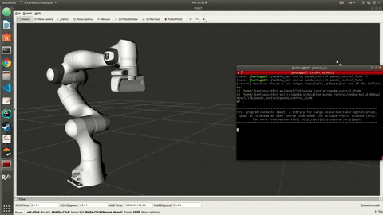
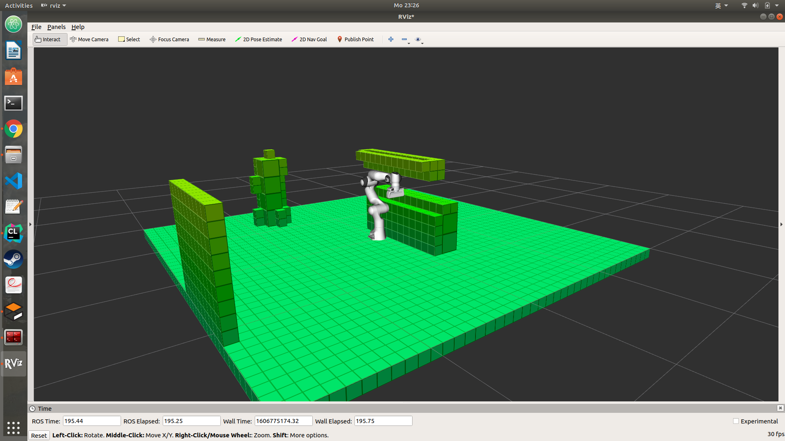

# ArmControl

 ### Simulation in Gazebo
Optimization-based Inverse Kinematics and Impedance Control in Gazebo.  

  

Optimization-based Trajectory Generation and Collision Avoidance in Gazebo.  

     

 ### In Progressing
Motion Planning in dense 3D Map
  
