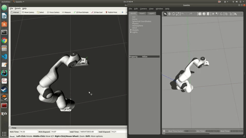
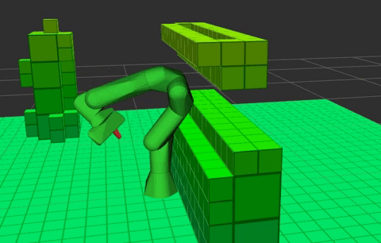
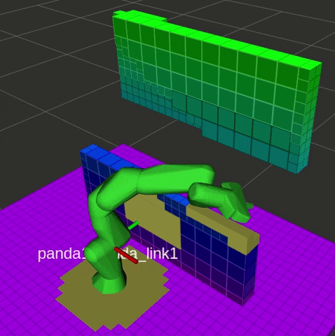

### Simulation in Gazebo
Optimization-based Inverse Kinematics and Impedance Control in Gazebo.  

  

Optimization-based Trajectory Generation and Collision Avoidance in Gazebo.  

  
  
Consider Orientation Soft Constraints
  

Collision Detection

  
  

